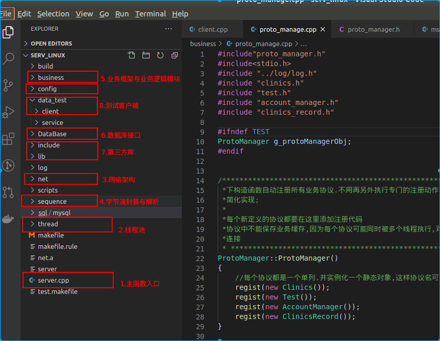

#                                  香梨健康开发文档                                                                                          


## 开发背景

​         随着老龄化加剧，慢性病逐渐流行，还有消费的升级，人们在健康方面的投入越来越多，而且传统以疾病为中心的生物医学模式几乎无法治愈慢性病。因此以健康为中心的新医学模式“生物——心理——社会功能”应运而生，新医学模式注重预防，从全生命、全人群的角度出发，通过生活方式管理、临床预防、合理治疗的三级预防策略促进人们健康，健康管理是这种新医学模式的核心理论。2013年国家提出《健康中国2030规划纲要》，中研预估2020大健康产业市场规模达到8万亿，健康管理是大健康的核心。

​       本产品开发目的就是为了将健康管理的理论经验用软件系统的方式表现出来，通过搜集用户生活习惯和健康信息，然后使用通过业界权威的健康评估模型评价用户的健康状况，然后自动生成个性化的健康指导方案，包括生活方式、临床预防和就医用药建议。数据搜集、健康智能评估、自动生成个性化的生活方式指导是本软件系统的核心。

​       数据搜集包括个人健康档案、家庭健康档案和社区健康档案。其中个人健康档案是重点，可以将平时的就医图文报告上传，也可以通过穿戴设备自动采集常规数据，还有可以自我完善个人信息。留有与医院信息系统的接口，可以自动从医院获取标准化的电子病历。给健康机构提供数据管理服务网页，健身房的设备和健身教练都可以录入体适能信息。药店和社区卫生服务中心也可以查看和录入卫生服务信息。社区卫生服务中心可以录入社区环境情况，比如水质量、空气质量、环境绿化和人文素养评价等。

​        软件会综合以上所有健康档案信息，依据国际公认的健康评估模型，计算出用户的健康分数、患病风险、可改善的空间以及健康年龄，以图文方式展示。      

​        生活方式包括营养、运动、心理、睡眠指导。目前阶段营养和运动是重点，经过智能评估后，软件会生成个性化且具体的饮食规划，告诉你每天吃什么、吃多少、什么时间吃；而且会计算出每天的能量、蛋白质、脂肪、矿物质和维生素的摄入量，并给出参考标准，以图表展示；饮食方案不仅关注吃得健康，还兼顾美味。运动指导类似饮食方案，会告诉你做什么运动、做多少、如何做，并运用国际代谢当量计算能量消耗，保证运动的最佳效果。饮食、运动方案在执行过程中可以进行标记，作为执行情况的监督，以备后续更好的评估和做出更加科学合理的评估和指导。


## 功能架构


说明：上图作为功能架构与具体软件功能没有直接联系


## 部署架构


说明：

1. 核心是中心服务器，综合处理健康管理的所有后台服务；
2. 重点数据来源是个人健康管理app，安装与用户手机上；
3. 针对社区医生、学校体能管理以网页形式交互；
4. 流行病学监督单独运行在疫情健康服务器上；


## 软件架构

### 整体架构


1. 一共有三个项目+运行脚本，主要是客户端app、运行在ubuntu18上的服务器和爬取基础健康数据的爬虫，另外项目的编译、发布打包、运行停止都是用shell脚本控制；
2. APP运行在Android手机上，采用MVC的分层架构，分为交互界面、界面数据更新和业务逻辑；另外网络通信和线程池有单独的模块负责；
3. linux运行在ubuntu18上，网络通信主要使用reactor架构，主要有epoll触发器、socket收发数据、线程池处理网络和业务任务，另外就是通用日志、服务器配置和数据库接口作为辅助模块；
4. 数据爬虫采用标准的架构：request抓取html、beautifulsoup解析html、数据清洗、pymysql将数据存储到mysql数据库，这个爬虫进程可以直接运行在ubuntu18后台；


### APP架构


### 服务器架构

- 项目部署

  

  1. 在一台ubuntu18的云主机上，运行两个docker镜像，一个是服务器，一个是数据库；
  2. 服务器具备外网IP和端口，app可以通过外网连接到服务器；
  3. mysql镜像与服务器镜像在同一台主机上，用127.0.0.1进行通信；


- 项目架构


1. 从功能上主要分为六大模块：配置管理、日志管理、线程池、网络通信、业务处理、数据库操作；
2. 配置模块：配置文件的修改和加载，包括数据库连接账户、服务器端口、日志登记、业务线程数量等参数；
3. 日志模块：支持日志等级修改，写日志；
4. 线程池模块：负责创建线程池，根据配置创建reator线程和业务处理线程对象，并启动所有线程；
5. 网络模块：基于reactor的高并发架构，触发器使用epoll，收到数据放入消息队列；
6. 业务模块：基于模板的设计模式，从消息队列获得任务---》解析字节流消息---》根据协议处理业务，将文件保存在磁盘，将结构化数据保存到数据库---》回复消息；添加新功能仅需要扩展协议对象即可，不需要关注通信、线程等其它逻辑；
7. 数据库模块：对mysql C语言接口的封装，完成数据库连接、增删改查等功能；

### 爬虫架构


## 服务器编译与运行

- 生成ssh key

```shell
#1.给需要clone源码的电脑配置好git账户
$git config --global user.email "1406133062@qq.com"
$git config --global user.name "yangyang"

#2.生成主机的isa(输入下面的命令后一路狂按enter即可)
$ssh-keygen -t rsa

#3.查看上一步生成的主机rsa，然后复制看到的内容，交给我帮你添加到团队中;或者我把你加入到项目团队，然后你自己将key添加到setting--->ssh key-->new key
$cat ~/.ssh/id_rsa.pub

#4.下载代码
$git clone git@github.com:XiangLiHealthy/XiangLiHealthyLife.git
```

- 编译服务器代码

```shell
#进入到makefile的目录
$cd XiangLiHealthyLife/serv_linux

#清理编译残留文件
$make clean

#执行编译
$make
```

- 运行

```shell
./server
```

## 服务器链接测试demo编译与运行

```shell
$cd data_test/client/

$make clean && make

#连接到服务器并指定连接数量 ./clent_tool [服务器ip]:[服务器端口] [链接数量]
$./client_tool 127.0.0.1:6666 1
```


## 服务器代码介绍

### 目录结构



##  服务器调试经验

- 查看日志

```shell
tail -f /etc/xiangli/log/2020-7-18.txt 
```


